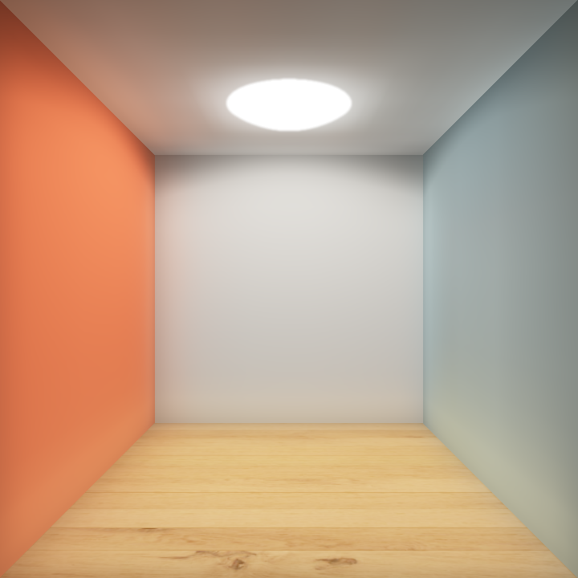
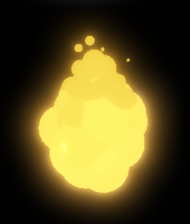
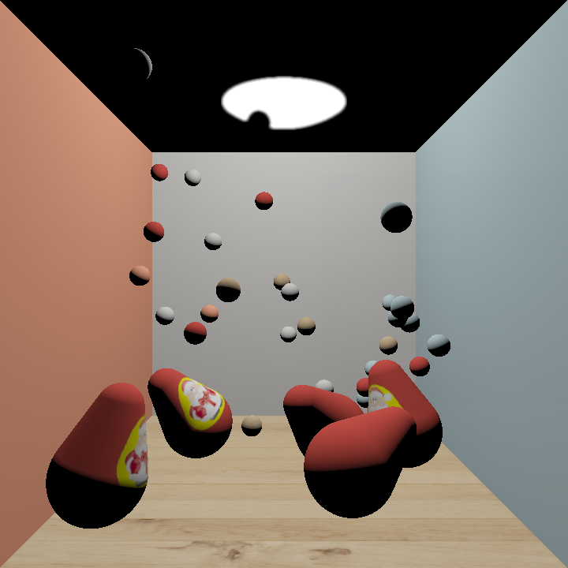
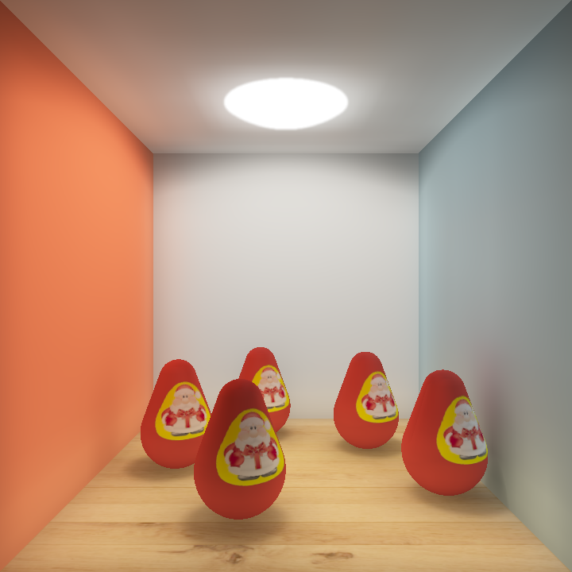
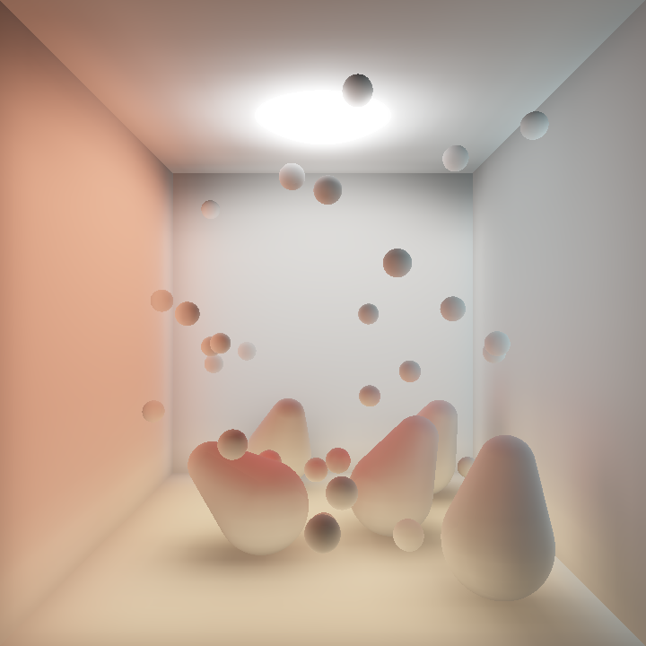

# 考试大作业 报告

521021910595 袁翊天

mygl3是我远古时期造的OpenGL轮子

gcem是拿来做constexpr的数学运算的，其实不用也没啥问题

## 具体工作

1. Cornell Box场景建模
1. 不倒翁的建模
1. 不倒翁与球体的有向距离场（SDF）计算
1. 不倒翁、小球、Cornell Box边界的碰撞检测
1. 物体碰撞后的物理响应
1. 基于不倒翁SDF Ray Cast的鼠标选取与交互
1. 火球、碰撞火花、灰烬的粒子效果
1. GBuffer延迟渲染
1. 通过Shadow Map实现阴影
1. 使用Voxel Cone Tracing实现全局光照效果
1. 发光体的泛光效果

## Cornell Box场景建模

本次作业中首先构建了经典的Cornell Box场景，如下图所示：

| 渲染效果                                        | 三角形网格                                           |
| ----------------------------------------------- | ---------------------------------------------------- |
|  |  |

其中左右的墙面分别设置为橙色和天蓝色；地面贴上木纹材质；天花板光源的半球面使用Icosphere生成（取Cornell Box内的三角形面片）。

本次作业中Cornell Box的坐标范围为$[-1,1]^3$，这是对所有物体的坐标范围限制。

## 不倒翁的建模

### 数学表示

**本次作业中使用数学方法对不倒翁进行建模**。这是由于不倒翁需要碰撞检测、物理响应、同时与鼠标交互，使用老师提供的不倒翁模型不够灵活高效（可能需要分析Mesh数据，很麻烦）。

本次作业中使用上下两个球面和连接两个球面的圆锥面构建不倒翁。又由于不倒翁显然是一个旋转体，所以其数学表示只需考虑旋转曲线。

这里设置三个参数：$b, t, \alpha$，其中$b$表示不倒翁下方球面半径、$t$表示不倒翁上方球面半径、$\alpha$为不倒翁侧面与旋转轴的夹角。其曲线如下所示：

在不倒翁的Local space中指定$y$轴为旋转轴、设定不倒翁下方球面的球心为$(0,0,0)$，可以计算出上方球面的球心坐标为$(0, \frac{b-t}{\sin \alpha}, 0)$，设$y_t = \frac{b-t}{\sin \alpha}$，有旋转曲线的解析式如下：

$R(y)=\begin{cases}\sqrt{b^2 - y^2}, & y \in [-b, b \sin \alpha) \\ -y\tan \alpha  + \frac{b}{\cos \alpha}, &y \in [b \sin \alpha, y_t + t \sin \alpha] \\ \sqrt{t^2 - (y - y_t)^2}, & y \in (y_t + t \sin \alpha, y_t + t]\end{cases}$

在作业中取$b = 0.2, t = 0.1, \alpha = \frac{\pi}{9}$

### 三角形网格生成

不倒翁的三角形网格生成较为简单，即使用UV Sphere方法生成上下两个半球，并通过三角形面片连接两个半球，生成的网格如下：

### SDF以及SDF梯度计算

不倒翁的SDF以及SDF梯度可以用于鼠标交互、碰撞检测、碰撞反馈，以下是在不倒翁坐标系（Local space）中计算SDF和SDF梯度的过程：

对于Local space中的坐标$\vec{p} = (x, y, z)$，记$r = \sqrt{x^2+z^2},r\ge 0$

观察发现在$r-y$平面中，当$(y,r)$坐标在下图的蓝色范围内时，SDF的值为$(y,r)$到边界直线$r=-y \tan\alpha + \frac{b}{\cos \alpha}$的有向距离，否则为上半球或下半球的SDF值：

因此可以现将$(y,r)$坐标进行旋转变换，即$\begin{bmatrix}y' \\ r'\end{bmatrix} = R \begin{bmatrix}y \\ r\end{bmatrix}$，使变换后的边界直线为$r' = b$，即可方便地判断坐标点是否在蓝色区域内并求出有向距离。

易得$R = \begin{bmatrix}\cos \alpha & -\sin \alpha \\ \sin \alpha & \cos \alpha\end{bmatrix}$

从而有

$\text{SDF}_{\text{local}}(\vec{p}) = \begin{cases}\sqrt{r^2 + y^2} - b, & y' < 0 \\ \sqrt{r^2 + (y - y_t)^2} - t, & y' >\frac{y_t}{\tan \alpha} \\ r' - b,  &\text{o.w.}\end{cases}, \\ \begin{bmatrix}y' \\ r'\end{bmatrix} = \begin{bmatrix}\cos \alpha & -\sin \alpha \\ \sin \alpha & \cos \alpha\end{bmatrix} \cdot \begin{bmatrix}y \\ r\end{bmatrix}, r = \sqrt{x^2+z^2}$

$\grad \text{SDF}_{\text{local}}(\vec{p})$的计算方法类似，即分别在三种情况下计算垂直于不倒翁面、方向朝外的单位向量，这里不再赘述。

本次作业中不倒翁会经过旋转和平移变换，World space中的$\text{SDF}_{\text{world}}$与$\grad\text{SDF}_{\text{world}}$可以通过将World space坐标变换回Local space来得到；SDF梯度还需要再通过旋转矩阵再变换到World space。

### 转动惯量矩阵计算

不倒翁的刚体物理模拟需要计算转动惯量。

设不倒翁的质量为$m$，根据推导可得Local space的转动惯量：

$V =\pi \int_{-b}^{y_t + t}R^2(y) \text{d}y,  \rho = \frac{m}{V}$

$I_{xx} = I_{zz} = \rho\frac{\pi}{4}\int_{-b}^{y_t + t}[R^4(y) + 4 y^2R^2(y)]\text{d} y$

$I_{yy} = \rho \frac{\pi}{2}\int_{-b}^{y_t + t}R^4(y) \text{d} y$

$I_{\text{local}} = \rho \begin{bmatrix}I_{xx} & 0 & 0 \\ 0 & I_{yy} & 0 \\ 0 & 0 & I_{zz}\end{bmatrix} $

这些积分可以通过数学工具计算，这里不再赘述。

World space中的转动惯量$I_{\text{world}} = R I_{\text{local}} R^{-1} = R I_{\text{local}} R^{T}$，$R_{3\times3}$为不倒翁的旋转矩阵。

## 物理模拟

### 刚体运动参数

刚体的运动参数包括线速度$\vec{v} = （v_x, v_y, v_z)$、角速度$\vec{\omega} = (\omega_x, \omega_y, \omega_z)$，位置$\vec{p} = (p_x, p_y, p_z)$。

旋转通过四元数$q$和旋转矩阵$R_{3\times3}$（单位正交，$R^{-1} = R^T$）表示，两者可以转化

每个时间戳$\Delta t$，$\vec{p}' = \vec{p} + \vec{v} \Delta t, q' = (1 +\frac{\Delta t}{2} q_\omega) \cdot q, q_\omega=\begin{pmatrix}0\\ R^{-1} \times \vec{\omega} \end{pmatrix}$

刚体上任意一点$\vec{p}_i$的点速度$\vec{v}_i = \vec{v} + \vec{\omega}\cross (\vec{p}_i - \vec{p})$

### Model矩阵

Model变换矩阵$M$首先考虑旋转$R$；而后平移到位置$\vec{p}$，因此有

$M = \begin{pmatrix}1 &  & &p_{x} \\  & 1 & & p_{y} \\  &  & 1 & p_{z} \\ & & & 1\end{pmatrix} \times  \begin{pmatrix}R_{3\times 3} & \\ & 1\end{pmatrix} =  \begin{pmatrix}R_{3\times 3} & \vec{p} \\ & 1\end{pmatrix}$

### 基本假设

在模拟不倒翁时，做以下假设：

1. 假设不倒翁的重心为下半球的球心，即Local space的原点
1. 假设不倒翁只在$x,z$轴有平移，$p_y \equiv -1 + b$，不会腾空
2. 假设不倒翁在地面做纯滚动、无滑动，即$v_x = -b\cdot\omega_z, v_z = b\cdot\omega_x$

在模拟球体（包括弹珠、火球）时，做以下假设：

1. 球体质心的机械能（不考虑角速度，$\frac{1}{2}mv^2 + mgh$）不会衰减，这样可以一直保持运动状态
2. 弹珠小球受重力影响；火球不受重力影响，可以自由飞行

### 冲量

设刚体的质量为$m$，转动惯量矩阵为$I$

在$\vec{p_j}$位置对刚体施加冲量$\vec{j}$后，线速度$\vec{v}' = \vec{v} + \frac{\vec{j}}{m}$

刚体的角速度$\vec{\omega}' = \vec{\omega} + I^{-1} \vec{r} \cross \vec{j}, \vec{r} = \vec{p_j} - \vec{p}$

对于不倒翁，由于假设仅做纯滚动，所以线速度$\vec{v}' = (-b\Delta \omega_z, 0, b\Delta \omega_x), \Delta \vec{\omega} = \vec{\omega}' - \vec{\omega}$

### 不倒翁的回复力与摩擦力

本次作业中通过对不倒翁施加恢复力实现“不倒”效果。

在每个时间戳$\Delta t$，设不倒翁的旋转轴方向为$\vec{d}$，在$\vec{p_j} = (p_x, p_y + 1, p_z)$位置施加$\vec{j} = -\Delta t \cdot \vec{d}$的冲量，即可实现回复效果。

摩擦力能够实现摆动的衰减，若没有摩擦力，倾斜的不倒翁会永远摆动下去。

施加摩擦力十分简单：设地面的摩擦系数为$\mu$，重力加速度为$g$。

在每个时间戳$\Delta t$，

$\vec{v}’ = \hat{v}\cdot\max\{0, ||v|| - \mu g \Delta t\}, \vec{\omega}’ = \hat{\omega}\cdot\max\{0, ||\omega|| - \frac{\mu g \Delta t}{b}\}$

### 碰撞检测与响应

#### 不倒翁与边界

不倒翁与边界的碰撞检测较为简单，只需检查不倒翁的**上、下两个球体**是否与边界相交即可。又由于不倒翁处在地面，因此只需考虑与地面、前后左右边界的碰撞。

当与前后左右边界碰撞时，首先将$\vec{p}$朝墙面法线方向修正以消除碰撞，而后将墙面方向的线速度和角速度反向（可以再乘以一个衰减系数）。

当与地面碰撞时，发生碰撞的必然是不倒翁上面的球体，这时需要修正不倒翁的旋转，同时将角速度与线速度清零以模拟倒地并缓慢回复的效果。

#### 球体与边界

球体与边界的碰撞更为简单，只需测试球心与上下左右前后边界的距离是否小于半径，若发生碰撞则修正球体的位置，并反转相应的线速度（这里不能乘以衰减系数，不然会导致球体机械能减少，违反了假设），同时设置角速度为在墙面纯滚动的角速度。

此外，本次作业也考虑了球体与Cornell Box顶部半球灯的碰撞。处理方法类似，即朝碰撞方向（即半球灯的法向）修正球体位置；并在碰撞方向反射线速度。

#### 球体与不倒翁

球体与不倒翁的碰撞需要借助不倒翁的SDF函数。

设球体的球心坐标为$\vec{p}$，半径为$r$。

球心与不倒翁表面的有向距离为$d = \text{SDF}_{\text{world}}(\vec{p})$。若$d < r$则认为球体与不倒翁发生碰撞。

碰撞的方向$\vec{n} = \grad\text{SDF}_{\text{world}}(\vec{p}) $，以此可以求出碰撞点$\vec{h} = \vec{p} - d \cdot \vec{n}$

在$\vec{n}$方向修正球体的位置，并将球体的线速度沿$\vec{n}$反向（这样球体的机械能不变）。

记球体线速度的变化为$\Delta \vec{v}$，在$\vec{h}$位置对不倒翁施加$\vec{j} = -m\Delta \vec{v}$的冲量，$m$为球体的质量，以维持碰撞的动量守恒。

#### 不倒翁与不倒翁

直接求解不倒翁碰撞较为复杂，本次作业使用一个近似方法：即分别将一个不倒翁的上下两个球体对另一个不倒翁进行碰撞检测，进行四次球体与不倒翁的碰撞检测，求解出平均碰撞点$\bar{h}$。

而后根据两个不倒翁在$\bar{h}$的SDF梯度$\vec{n}_1,\vec{n}_2$，算出平均碰撞方向$\bar{n} = \frac{\vec{n}_1 - \vec{n}_2}{||\vec{n}_1 - \vec{n}_2||}$。

接下来需要根据两个不倒翁在$\bar{h}$的点速度$\vec{v}_1, \vec{v}_2$算出需要施加的冲量：

1. 算出$\vec{v}_1, \vec{v}_2$在$\bar{n}$方向的投影$\vec{v}_{1,n} = \vec{v}_1 \cdot \bar{n}, \vec{v}_{2,n} = \vec{v}_2 \cdot \bar{n}$

2. $\Delta \vec{v}_n = \vec{v}_{1,n} - \vec{v}_{2,n}$

3. 计算出冲量$\vec{j}_1, \vec{j}_2$，使得两个刚体在$\bar{h}$的点速度分别变化$-e\Delta \vec{v}_n, e\Delta \vec{v}_n $，参数$e$用于控制动量的衰减

冲量的计算过程如下：

* 设$\Delta \vec{v}_i$为施加冲量$\vec{j}$后刚体$i$点的速度变化、刚体中心为$\vec{p}$、质量为$m$、转动惯量为$I$、施加冲量的位置为$\vec{p}_j$

* $\Delta \vec{v}_i &= \frac{\vec{j}}{m}+ [I^{-1}\cdot (\vec{r}_j \cross \vec{j})] \cross \vec{r}_j, \vec{r}_j = \vec{p}_j - \vec{p} \\ & = \frac{\vec{j}}{m} -  [r_j]_\cross I^{-1}[r_j]_\cross \cdot\vec{j}$

* （$[r_j]_\cross$为$\vec{r}_j$的反称矩阵，将向量叉乘变为矩阵运算）

* 记$K_{3\times3} = \frac{1}{m} -  [r_j]_\cross I^{-1}[r_j]_\cross$，有$\Delta \vec{v}_i = K \vec{j}$

* 从而所求的冲量$\vec{j}=K^{-1} \Delta \vec{v_i}$

（这个碰撞响应不太物理，但效果还不错） 

### 弹珠与火球

通过物理模拟，弹珠与火球的实现都是非常简单的，只要设置其半径、质量、初始位置、初速度，而后一切交给物理模拟即可。

至于弹珠碰撞变材质之类的都是一个Callback能解决的问题，不赘述。

## 鼠标交互

### 不倒翁选取

不倒翁的选取通过SDF Ray Cast实现，即：

* 通过View Projection矩阵的逆矩阵以及View Position从鼠标位置构造Ray
* 遍历场景中五个不倒翁，分别做SDF Ray Cast
  * 每次沿射线前进该点SDF值
  * 直到SDF值小于某个阈值（相交）或者前进步数过多（不相交）
* 存在不倒翁与射线相交，SDF Ray Cast前进距离最小的不倒翁为选取到的不倒翁
* 根据前进距离可以求得Ray与不倒翁的交点：若交点的$y$坐标小于$-1 + b$，则认为交点在重心下方，对不倒翁进行平移；否则做旋转操作

### 平移

首先在记录初始时Ray与不倒翁的交点$\vec{s}$。

当鼠标拖动，计算新的Ray与平面$y = s_y$的交点，作为不倒翁的新位置。

### 旋转

转动时直接根据鼠标在屏幕上的拖动唯一对$x,z$轴做旋转，同时也要平移响应的距离以模拟纯滚动。

## 粒子系统

本次作业中的粒子用纯色球体表示，球体的颜色和半径由粒子的剩余寿命决定。（一些具体的参数有些丑陋，就不赘述了，这里仅定性描述）

### 火焰粒子

* 每秒从火球生成400个火焰粒子，粒子随机分布在火球内部（越靠球心概率越高，以实现）
* 初始寿命设置为0.45秒
* 初速度为一个向上的随机速度和火球的点速度加权
* 粒子的半径和亮度随着寿命的减少而减小
* 效果如下：

### 碰撞火花粒子

火花粒子在火球与物体碰撞时出现。

* 该粒子在碰撞点周围生成；初始寿命设置为1秒（加了一点随机抖动）
* 初速度根据碰撞方向随机分布
* 受重力影响
* 粒子的半径和亮度随着寿命的减少而减小

### 灰烬粒子

灰烬粒子在火球与弹珠碰撞时出现以实现弹珠燃烧殆尽的效果。

* 该粒子在弹珠的位置生成
* 初始寿命设置为1秒（加了一点随机抖动）
* 初速度与弹珠的线速度成比例
* 受重力影响，同时粒子的速度会随机抖动以模拟灰烬飘落的效果
* 粒子的半径和亮度随着寿命的减少而减小，当半径小于一个阈值时会迅速从高亮度粒子变为黑色，模拟灰烬冷却的效果

## 渲染

### 管线概述

本次作业的渲染管线如下图所示：

* GBuffer Pass：绘制场景中的所有物体，将颜色、法线、深度存储到三个Texture中
* Shadow Map Pass：从顶部光源的视角绘制场景中的遮挡物（不倒翁和弹珠，火球因为是发光体就不算在里面），将深度图存储到Texture
* Voxelize Pass：绘制Cornell Box、不倒翁、火球，借助Shadow Map计算Direct Light，体素化存储到3D Texture（$64^3$）中
* Voxel Mipmap Pass：将Voxelize得到的3D Texture降采样，以便于Voxel Cone Tracing
* Bloom Pass：截取GBuffer颜色中的高光部分做Gaussian Blur，存储到Textre
* Final Pass：绘制最终的图像到屏幕

### Direct Light

#### Diffuse

本次作业中假设除了发光体，所有表面均为漫反射表面；场景中光源为Cornell Box顶部的半球灯，近似于点光源。使用$I_{\text{diff}}=k_d I_l \cos \theta$计算，效果如下：

#### Directional Light

理论上（？）Cornell Box中的光源不是点光源（因为球体的大部分是被遮挡的），因此墙壁上方应该有一定的阴影，类似Direction Light。作业中从光源方向与$(0,1,0)$的夹角计算一个衰减量来模拟这个效果，如下：

#### Shadow Mapping

本次作业使用传统的Shadow Mapping。

由于点光源（位置为Cornell Box顶部半球灯的球心）在$[-1,1]^3$外，一个Shadow Map Texture足够涵盖$[-1,1]^3$范围内的所有物体，无需使用Cubemap Texture。

在Final Pass中使用$5 \times 5$ PCF采样实现软阴影，效果如下：

### 基于体素的全局光照

（Cornell Box没有全局光照就如同西方没有耶路撒冷）

#### Why Voxels？

编写程序时考虑过以下方案：

|          | Voxel Cone Tracing                                           | Path Tracing                                                 |
| -------- | ------------------------------------------------------------ | ------------------------------------------------------------ |
| **优点** | 1. 渲染结果平滑，无需降噪 2. 渲染结果不依赖Temporal Data，对动态物体支持较好 3. 作业场景只需很小的3D Texture，渲染性能较好 | 全局光照渲染结果准确                                         |
| **缺点** | 全局光照渲染的近似度一般                                     | 1. 采样和Denoise大概率有性能问题 2. 需要Temporal Filter + Denoise，对动态物体不友好，且容易产生画面波动   |
|          | **SSDO**                                                     | **Baked Light Probe**                                        |
| **优点** | 渲染性能较好                                                 | 1. 渲染性能较好 2. 不考虑动态物体时渲染结果比较准确     |
| **缺点** | 1. 全局光照渲染的近似度较差（大概率连天花板都照不亮） 2. Screen-Space技术对动态场景容易产生不稳定的结果 | 不支持动态物体与场景的光影交互                               |

最终选定了Voxel Cone Tracing。

#### 场景体素化

本次作业使用经典的GPU体素化算法将场景体素化，体素用$64^3$的3D Texture存储，体素的值为该点的Radiance：

* 由于场景是动态的，每帧需要重新体素化，因此先将3D Texture清空
* 对于几何法向量为$\vec{n}=(n_x, n_y, n_z)$的三角形，将其投影到$\text{axis} = \underset{a \in \{x, y, z\}}{\mathrm{argmin}}|n_a|$所对应的平面（在Geometry Shader完成）
* 做光栅化，计算Direct Light作为Radiance（同样借助Shadow Map，但不做PCF采样），存储在Fragment对应的体素坐标
* 在体素化时使用低精度Mesh可以有效提升性能
* 粒子等动态发光体也要体素化，以产生动态全局光照效果

结果如下图所示（此图为Voxel Ray March得到的）：

#### 体素Mipmap生成

Voxel Cone Tracing需要采样不同范围内体素的平均Radiance，在存储体素的3D Texture做Mipmap可以支持这一流程。

传统的Mipmap仅计算$2^3$个像素的平均值，没有考虑Cone Tracing时不同Ray Direction的采样问题，可能导致采样时临近的体素权重过大以至于产生**自遮挡**。

解决方法是从$-x,+x,-y,+y,-z,+z$六个方向做各向异性的Mipmap（在$2^3$个体素中增加方向上的$2^2$个体素的权重），存在六张3D Texture中，而后在采样时根据Ray Direction对$\pm x, \pm y, \pm z$方向的Mipmap做加权。

> 
>
> 这张图很好地解释了各项异性Mipmap和采样的方法
>
> https://research.nvidia.com/sites/default/files/publications/GIVoxels-pg2011-authors.pdf

其效果如下：

| 传统Mipmap                      | 各项异性Mipmap               |
| ------------------------------- | ---------------------------- |
|  |  |

显然借助传统Mipmap渲染的图像物体自遮挡非常严重（天花板和右墙面很明显），导致整体偏暗；使用各向异性Mipmap明显地改善了这个问题。

#### Voxel Cone Tracing

Voxel Cone Tracing即在一个圆锥体中进行体素采样（四线性插值：3D + Mipmap）以获得圆锥体内的Radiance给该点的光照，如下图所示：

> 
>
> https://research.nvidia.com/sites/default/files/publications/GIVoxels-pg2011-authors.pdf

本次作业中对每个表面做6个Cone Trace，以实现Diffuse Global Illumination的效果，如下图所示：

| 6个Diffuse Cone                                              | Indirect Light                   |
| ------------------------------------------------------------ | -------------------------------- |
|  https://github.com/jose-villegas/VCTRenderer |  |

此外，Voxel Cone Tracing还能实现镜面反射、Multiple Bounce GI等效果，但这些效果的Computational Cost较大，且对渲染效果的提升一般，因此本次作业没有实现。

### 泛光

## 性能分析

